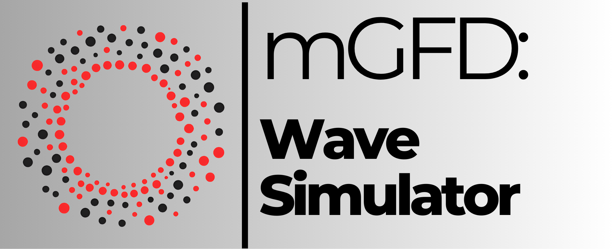
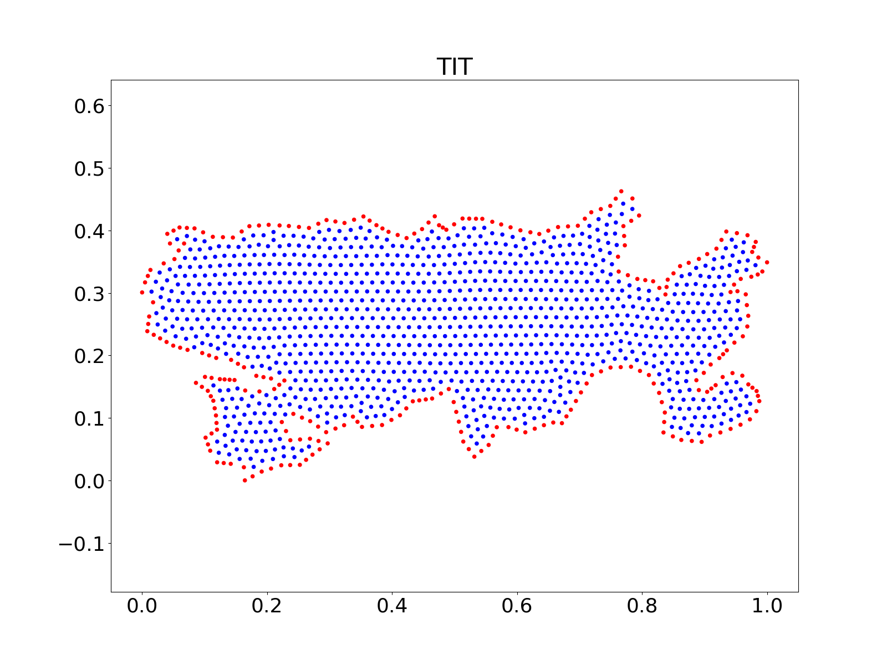
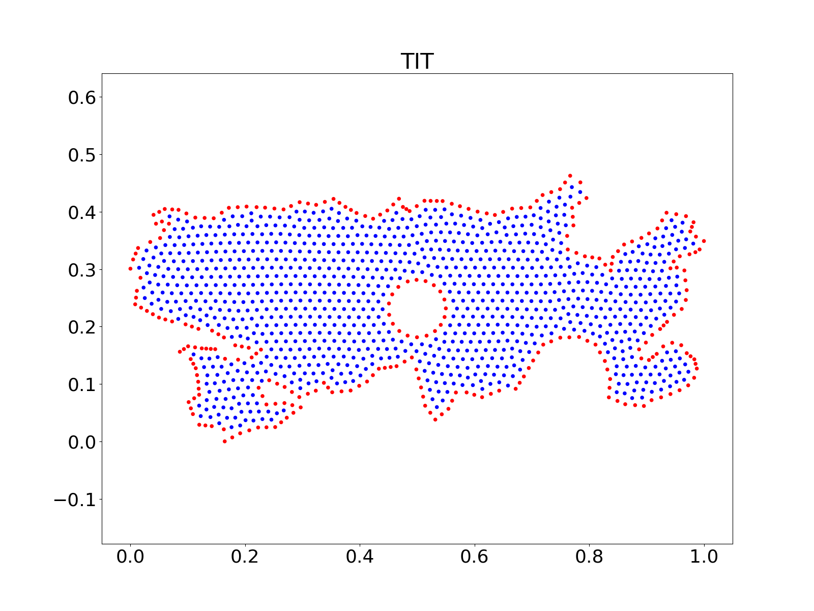
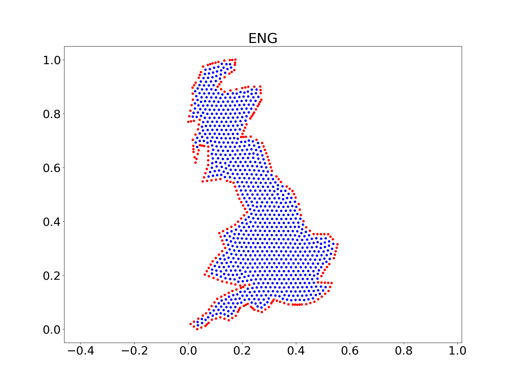
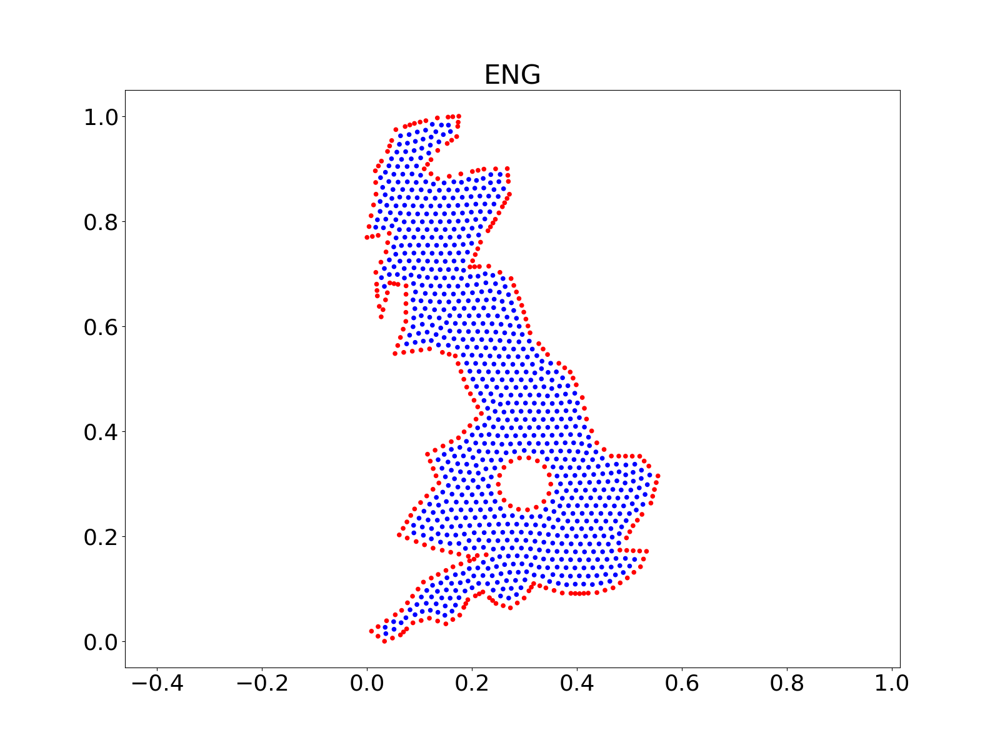

# mGFD: WaveSimulator :ocean:

<div align="center">



[](https://github.com/gstinoco/WaveGFD) [](https://www.python.org/downloads/) [](https://numpy.org/) [](https://scipy.org/) [](https://pandas.pydata.org/) [](https://matplotlib.org/) [](https://opensource.org/licenses/MIT)

**Meshless Generalized Finite Differences (mGFD) solver for the 2D wave equation on irregular point clouds**

*Solve on unstructured clouds (with or without holes), compute errors, and generate figures/animations*

### :link: Quick Links
[](#rocket-quick-start) [](#package-installation--setup) [](#books-mathematical-model) [](#file_cabinet-dataset-structure) [](#movie_camera-visualizations) [](#scientist-research-team) [](#memo-citation--license) [](#pray-acknowledgments)

</div>

---

## :clipboard: Table of Contents
- [Overview](#star2-overview)
- [Features](#sparkles-features)
- [Installation & Setup](#package-installation--setup)
- [Quick Start](#rocket-quick-start)
- [Usage Guide](#book-usage-guide)
- [Visualizations](#movie_camera-visualizations)
- [API Documentation](#gear-api-documentation)
- [Data Formats](#file_cabinet-data-formats)
- [Project Architecture](#open_file_folder-project-architecture)
- [Mathematical Model](#books-mathematical-model)
- [Dataset Structure](#file_cabinet-dataset-structure)
- [Performance Benchmarks](#chart_with_upwards_trend-performance-benchmarks)
- [Contributing](#handshake-contributing)
- [Research Team](#scientist-research-team)
- [Industry Partners Supporting Innovation](#factory-industry-partners-supporting-innovation)
- [Scientific References](#books-scientific-references)
- [Citation & License](#memo-citation--license)
- [Acknowledgments](#pray-acknowledgments)
- [Contact](#email-contact--support)
- [FAQ](#speech_balloon-faq)

---

## :star2: Overview

**mGFD: WaveSimulator** provides data and Python implementations to compute **numerical approximations of the 2D wave equation** on **unstructured point clouds** using a **meshless Generalized Finite Differences (mGFD)** scheme.

Target PDE (on an irregular domain):

$$\frac{\partial^2 u}{\partial t^2} = c^2 \nabla^2 u$$

### :wrench: Key Capabilities
- **Meshless discretization**: no structured mesh required, only a point cloud and a local neighbor set per node.
- **Irregular domains**: supports regular and highly irregular regions, including **interior holes** (multi-region boundaries).
- **Explicit/implicit time stepping**: optional implicit formulation controlled by `implicit` and `lam`.
- **Error evaluation**: utilities to compute error metrics between numerical and analytical solutions.
- **Visualization**: scripts to generate **PNG snapshots** and **MP4 animations** (requires `ffmpeg`).

### :microscope: Typical Applications

| Field | Application | Use Case |
|-------|-------------|----------|
| **Computational Physics** :satellite: | Wave propagation | Irregular boundaries and discontinuous geometries |
| **Engineering** :building_construction: | Structural / acoustic waves | Meshless node-based discretizations |
| **Geosciences** :mountain: | Geography-driven domains | Region shapes taken from maps / contours |
| **Numerical Analysis** :abacus: | Stability studies | Parameter sweeps over unstructured clouds |

---

## :sparkles: Features

### :cloud: Cloud-Based Solver (mGFD)
- Solves the 2D wave equation on a cloud of nodes with boundary flags.
- Uses local neighbor stencils to approximate the Laplacian via generalized finite differences.
- Computes both **numerical** and **theoretical** solutions when an analytical `f(x,y,t)` is provided.

### :users: Neighbor Computation
- Neighbor search based on a data-driven radius derived from the cloud spacing.
- Optional neighbor extraction from a provided triangulation (`*_tt.csv`).

### :bar_chart: Error & Diagnostics
- Error utilities to quantify differences between numerical and analytical solutions across time.
- Ready-to-run examples for multiple domains and cloud sizes.

### :movie_camera: Figures & Animations
- Snapshot exports (PNG) at multiple time instants.
- Side-by-side numerical vs analytical visualization for validation.
- MP4 generation via Matplotlib animation writer (`ffmpeg`).

---

## :package: Installation & Setup

### :computer: System Requirements

| Component | Minimum | Recommended |
|-----------|---------|-------------|
| **Python** | 3.9+ | 3.10+ |
| **RAM** | 4 GB | 8 GB+ (for larger clouds / longer runs) |
| **CPU** | 2 cores | 4+ cores |
| **OS** | Windows/Linux/macOS | Linux/macOS |

### :clipboard: Dependencies

```python
numpy
scipy
pandas
matplotlib
```

Optional (for MP4 export):
- `ffmpeg`

### Quick Installation

```bash
git clone https://github.com/gstinoco/WaveGFD.git
cd WaveGFD

python -m venv wavegfd_env
source wavegfd_env/bin/activate  # On Windows: wavegfd_env\Scripts\activate

pip install numpy scipy pandas matplotlib
```

### :white_check_mark: Installation Verification

```bash
python -c "import numpy, scipy, pandas, matplotlib; print(':white_check_mark: Dependencies OK')"
```

Optional `ffmpeg` check:

```bash
ffmpeg -version
```

---

## :rocket: Quick Start

<table>
  <thead>
    <tr>
      <th align="left" width="170">Step</th>
      <th align="left">What to do</th>
    </tr>
  </thead>
  <tbody>
    <tr>
      <td><b>1) Run an example</b></td>
      <td>
        <pre><code>python Example_1.py</code></pre>
      </td>
    </tr>
    <tr>
      <td><b>2) Outputs</b></td>
      <td>
        Results are written under <code>Results/</code> (videos + PNG snapshots) if <code>Save = True</code>.
      </td>
    </tr>
    <tr>
      <td><b>3) Switch geometry</b></td>
      <td>
        Examples run both <b>Clouds</b> and <b>Holes</b> datasets by toggling <code>Holes</code>.
      </td>
    </tr>
  </tbody>
</table>

---

## :book: Usage Guide

<div align="center">

*Practical workflows for running the included examples and using the solver as a Python module*

</div>

### :triangular_flag_on_post: Minimal Solver Call

```python
import numpy as np
import pandas as pd
import Wave_2D

c = np.sqrt(1/2)
cho = 1
r = np.array([0.0, 0.0])
t = 2000

f = lambda x, y, t, c, cho, r: np.cos(np.pi*t) * np.sin(np.pi*(x + y))
g = lambda x, y, t, c, cho, r: -np.sin(np.pi*t) * np.sin(np.pi*(x + y))

p = pd.read_csv("Data/Clouds/3/TIT_p.csv", header=None).to_numpy()
tt = pd.read_csv("Data/Clouds/3/TIT_tt.csv", header=None).to_numpy()

u_ap, u_ex, vec = Wave_2D.Cloud(
    p, f, g, t, c, cho, r,
    triangulation=False,
    tt=tt,
    implicit=True,
    lam=0.5,
)
```

### :wrench: Notes
- `p` must include a boundary flag in the third column: `0` interior, `1/2` boundary types.
- If `triangulation=True`, neighbors are derived from `tt`. Otherwise, neighbors are computed directly from the cloud.
- Large runs generate dense matrices; reduce `t` or use smaller clouds for quick experimentation.

---

## :movie_camera: Visualizations

### :framed_picture: Geometry Gallery (Clouds vs Holes)

<div align="center">

<table>
  <tr>
    <td align="center">
      <b>Titicaca</b><br/>
      <sub>Clouds dataset</sub><br/><br/>
      <br/><br/>
      <sub>Holes dataset</sub><br/><br/>
      
    </td>
    <td align="center">
      <b>England Bay</b><br/>
      <sub>Clouds dataset</sub><br/><br/>
      <br/><br/>
      <sub>Holes dataset</sub><br/><br/>
      
    </td>
  </tr>
</table>

</div>

### :film_projector: Numerical Solution Videos

The example scripts can export MP4 animations via Matplotlib. If you get errors while saving videos, install `ffmpeg` and re-run.

<div align="center">

<table>
  <tr>
    <td align="center">
      <b>Example 1 — ENG (Holes, size 3)</b><br/>
      <sub>Approximation vs theoretical</sub><br/><br/>
      <video src="docs/videos/example1_eng_holes_size3.mp4" controls width="320"></video><br/><br/>
      <a href="docs/videos/example1_eng_holes_size3.mp4"><code>example1_eng_holes_size3.mp4</code></a>
    </td>
    <td align="center">
      <b>Example 3 — TIT (Holes, size 3)</b><br/>
      <sub>Localized pulse propagation</sub><br/><br/>
      <video src="docs/videos/example3_tit_holes_size3.mp4" controls width="320"></video><br/><br/>
      <a href="docs/videos/example3_tit_holes_size3.mp4"><code>example3_tit_holes_size3.mp4</code></a>
    </td>
  </tr>
</table>

</div>

---

## :gear: API Documentation

mGFD: WaveSimulator is organized as a small set of solver and utility modules:

| Module / Function | Purpose |
|------------------|---------|
| `Wave_2D.Cloud` | Core solver: computes numerical (`u_ap`) and theoretical (`u_ex`) solutions + neighbor map (`vec`) |
| `Scripts.Neighbors.Cloud` | Neighbor search directly from cloud spacing |
| `Scripts.Neighbors.Triangulation` | Neighbor extraction from a triangulation connectivity table |
| `Scripts.Gammas.Cloud` | mGFD stencil weights (Gamma coefficients) and operator assembly |
| `Scripts.Errors.Cloud` | Error computation between `u_ap` and `u_ex` |
| `Scripts.Graph.Cloud` | Side-by-side numerical vs analytical surface animations |
| `Scripts.Graph.Cloud_Steps` | PNG snapshots at multiple time instants |

---

## :file_cabinet: Data Formats

### :triangular_flag_on_post: Node Cloud CSV (`*_p.csv`)

The point cloud is stored as a CSV without headers:

```csv
x,y,flag
0.1234,0.5678,0
0.1240,0.5681,1
...
```

Where `flag` indicates node type:
- `0`: interior node
- `1` / `2`: boundary node categories (used by boundary condition handling)

### :triangular_ruler: Triangulation CSV (`*_tt.csv`)

Triangle connectivity stored as integer indices (one triangle per row):

```csv
i,j,k
0,1,2
2,3,0
...
```

---

## :open_file_folder: Project Architecture

```
:package: mGFD_WaveSimulator/
├── Wave_2D.py                              # Core mGFD wave solver
├── Example_1.py                            # Analytical boundary condition (case 1)
├── Example_2.py                            # Analytical boundary condition (case 2)
├── Example_3.py                            # Zero boundary + localized initial pulse
│
├── Scripts/
│   ├── Gammas.py                           # mGFD stencil weights and operator assembly
│   ├── Neighbors.py                        # Neighbor search on clouds / triangulations
│   ├── Errors.py                           # Error metrics
│   ├── Graph.py                            # Figures and animations
│   └── TarFile.py                          # Utility for tar.gz packaging
│
├── Data/
│   ├── Clouds/                             # Unstructured clouds by size (1,2,3)
│   └── Holes/                              # Same regions with interior holes
│
└── docs/                                   # Assets used by this README
    ├── logo/
    ├── team/
    ├── gallery/
    └── videos/
```

---

## :books: Mathematical Model

mGFD: WaveSimulator computes an approximation of the 2D wave equation:

$$\frac{\partial^2 u}{\partial t^2} = c^2 \nabla^2 u$$

On an irregular domain represented by a node set $\{\mathbf{x}_i\}_{i=1}^m$. For each node $\mathbf{x}_i$, a local neighbor set $\mathcal{N}(i)$ is built, and generalized finite difference weights are computed to approximate differential operators locally:

$$\nabla^2 u(\mathbf{x}_i) \approx \sum_{j \in \{i\} \cup \mathcal{N}(i)} \Gamma_{ij} \, u(\mathbf{x}_j)$$

Time stepping follows a standard second-order formulation with optional implicit stabilization controlled by `implicit=True` and the parameter `lam \in [0,1]`.

---

## :file_cabinet: Dataset Structure

The `Data/` folder includes multiple regions and cloud sizes:

```
Data/
├── Clouds/
│   ├── 1/ 2/ 3/                           # Cloud size level
│   │   ├── <REG>_p.csv                    # nodes + boundary flags
│   │   ├── <REG>_tt.csv                   # triangulation connectivity
│   │   └── <REG>.png                      # geometry preview
└── Holes/
    ├── 1/ 2/ 3/
        ├── <REG>_p.csv
        ├── <REG>_tt.csv
        └── <REG>.png
```

Region codes include (among others): `TIT` (Titicaca), `ENG` (England Bay), `MIC`, `PAT`, `GIB`, `ZIR`, etc.

---

## :chart_with_upwards_trend: Performance Benchmarks

Performance depends on the number of nodes $m$, neighbor count (`nvec`), and time steps `t`.

### :stopwatch: Scaling Overview

| Stage | Core operation | Typical scaling |
|-------|----------------|-----------------|
| Neighbor search | radius-based neighbor selection | ~ $O(m^2)$ (vectorized distance matrix) |
| Stencil weights | pseudoinverse per node | ~ $O(m \cdot nvec^3)$ |
| Time stepping | dense matrix-vector multiplications | depends on operator storage (dense in current implementation) |
| Visualization | surface rendering + video encoding | ~ proportional to plotted frames |

---

## :handshake: Contributing

<div align="center">

### :star2: Contribute to the Project
*Bug reports, feature requests, and pull requests are welcome*

[](https://github.com/gstinoco/WaveGFD/issues)
[](https://github.com/gstinoco/WaveGFD/pulls)

</div>

### :bug: Bug Reports
1. **Search existing issues**: Check if the bug has already been reported
2. **Create a detailed report**: Include steps to reproduce and expected vs actual behavior
3. **Provide context**: OS, Python version, region, cloud size, and time step settings

---

## :scientist: Research Team

<div align="center">

### :star2: Meet the Team
*Researchers and graduate students advancing meshless computational methods*

</div>

### :busts_in_silhouette: Main Researchers

<table align="center">
  <thead>
    <tr>
      <th align="center" width="120">Photo</th>
      <th align="left">Researcher</th>
      <th align="left">Affiliation</th>
      <th align="left">Contact</th>
    </tr>
  </thead>
  <tbody>
    <tr>
      <td align="center" width="120">
        
      </td>
      <td>
        <b>Dr. Gerardo Tinoco Guerrero</b> :mexico:<br/>
        <sub>Numerical Methods &amp; Computational Mathematics</sub>
      </td>
      <td>
        <a href="http://www.siiia.com.mx"></a><br/>
        <a href="http://www.umich.mx"></a>
      </td>
      <td>
        <a href="mailto:gerardo.tinoco@umich.mx"></a><br/>
        <a href="https://orcid.org/0000-0003-3119-770X"></a><br/>
        <a href="https://www.researchgate.net/profile/Gerardo-Tinoco-Guerrero"></a>
      </td>
    </tr>
    <tr>
      <td align="center" width="120">
        
      </td>
      <td>
        <b>Dr. Francisco Javier Domínguez Mota</b> :mexico:<br/>
        <sub>Applied Mathematics &amp; Finite Difference Methods</sub>
      </td>
      <td>
        <a href="http://www.siiia.com.mx"></a><br/>
        <a href="http://www.umich.mx"></a>
      </td>
      <td>
        <a href="mailto:francisco.mota@umich.mx"></a><br/>
        <a href="https://orcid.org/0000-0001-6837-172X"></a><br/>
        <a href="https://www.researchgate.net/profile/Francisco-Dominguez-Mota"></a>
      </td>
    </tr>
    <tr>
      <td align="center" width="120">
        
      </td>
      <td>
        <b>Dr. José Alberto Guzmán Torres</b> :mexico:<br/>
        <sub>Engineering Applications &amp; Artificial Intelligence</sub>
      </td>
      <td>
        <a href="http://www.siiia.com.mx"></a><br/>
        <a href="http://www.umich.mx"></a>
      </td>
      <td>
        <a href="mailto:jose.alberto.guzman@umich.mx"></a><br/>
        <a href="https://orcid.org/0000-0002-9309-9390"></a><br/>
        <a href="https://www.researchgate.net/profile/Jose-Guzman-Torres"></a>
      </td>
    </tr>
    <tr>
      <td align="center" width="120">
        
      </td>
      <td>
        <b>Dr. José Gerardo Tinoco Ruiz</b> :mexico:<br/>
        <sub>Numerical Methods &amp; Scientific Computing</sub>
      </td>
      <td>
        <a href="http://www.umich.mx"></a>
      </td>
      <td>
        <a href="mailto:jose.gerardo.tinoco@umich.mx"></a><br/>
        <a href="https://orcid.org/0000-0002-0866-4798"></a>
      </td>
    </tr>
    <tr>
      <td align="center" width="120">
        
      </td>
      <td>
        <b>Dr. Heriberto Arias Rojas</b> :mexico:<br/>
        <sub>Engineering Applications</sub>
      </td>
      <td>
        <a href="http://www.siiia.com.mx"></a><br/>
        <a href="http://www.umich.mx"></a>
      </td>
      <td>
        <a href="mailto:heriberto.arias@umich.mx"></a><br/>
        <a href="https://orcid.org/0000-0002-7641-8310"></a><br/>
        <a href="https://www.researchgate.net/profile/Heriberto-Arias-Rojas"></a>
      </td>
    </tr>
  </tbody>
</table>

### :mortar_board: Ph.D. Research Students

<table align="center">
  <thead>
    <tr>
      <th align="center" width="120">Photo</th>
      <th align="left">Student</th>
      <th align="left">Institution</th>
      <th align="left">Contact</th>
    </tr>
  </thead>
  <tbody>
    <tr>
      <td align="center" width="120">
        
      </td>
      <td>
        <b>Gabriela Pedraza-Jiménez</b><br/>
        
      </td>
      <td>
        <a href="http://www.umich.mx"></a>
      </td>
      <td>
        <a href="mailto:2220157h@umich.mx"></a>
      </td>
    </tr>
    <tr>
      <td align="center" width="120">
        
      </td>
      <td>
        <b>Eli Chagolla-Inzunza</b><br/>
        
      </td>
      <td>
        <a href="http://www.umich.mx"></a>
      </td>
      <td>
        <a href="mailto:1137626b@umich.mx"></a>
      </td>
    </tr>
  </tbody>
</table>

### :mortar_board: M.Sc. Research Students

<table align="center">
  <thead>
    <tr>
      <th align="center" width="120">Photo</th>
      <th align="left">Student</th>
      <th align="left">Institution</th>
      <th align="left">Contact</th>
    </tr>
  </thead>
  <tbody>
    <tr>
      <td align="center" width="120">
        
      </td>
      <td>
        <b>Jorge L. González-Figueroa</b><br/>
        
      </td>
      <td>
        <a href="http://www.umich.mx"></a>
      </td>
      <td>
        <a href="mailto:1718717h@umich.mx"></a>
      </td>
    </tr>
    <tr>
      <td align="center" width="120">
        
      </td>
      <td>
        <b>Christopher N. Magaña-Barocio</b><br/>
        
      </td>
      <td>
        <a href="http://www.umich.mx"></a>
      </td>
      <td>
        <a href="mailto:1339846k@umich.mx"></a>
      </td>
    </tr>
  </tbody>
</table>

### :mortar_board: Undergraduate Research Students

<table align="center">
  <thead>
    <tr>
      <th align="center" width="120">Photo</th>
      <th align="left">Student</th>
      <th align="left">Institution</th>
      <th align="left">Contact</th>
    </tr>
  </thead>
  <tbody>
    <tr>
      <td align="center" width="120">
        
      </td>
      <td>
        <b>Maria Goretti Fraga-Lopez</b><br/>
        
      </td>
      <td>
        <a href="http://www.umich.mx"></a>
      </td>
      <td>
        <a href="mailto:1702174b@umich.mx"></a>
      </td>
    </tr>
  </tbody>
</table>

---

## :factory: Industry Partners Supporting Innovation

<div align="center">

### :star2: Industry Partners Supporting Innovation
*Collaboration between academia and industry to accelerate real-world impact*

</div>

<div align="center">

<table align="center" width="70%">
<tr>
<td align="center">

### :factory: **SIIIA MATH**
#### *Soluciones de Ingeniería, México*

<div align="center">

[](http://www.siiia.com.mx)
[](http://www.siiia.com.mx)
[](http://www.siiia.com.mx)

</div>

**🎯 Focus areas:**
- Mathematical modeling & simulation
- AI/ML engineering solutions
- Technology transfer and applied R&amp;D

<div align="center">

[](mailto:gtinoco@siiia.com.mx)

</div>

</td>
</tr>
</table>

</div>

---

## :books: Scientific References

1. Tinoco-Guerrero G., Arias-Rojas H., Guzmán-Torres J.A., Román-Gutiérrez R., and Tinoco-Ruiz J.G. (2023). *A meshless finite difference scheme applied to the numerical solution of wave equation in highly irregular space regions.* **Computers & Mathematics with Applications**, 136, 25–33. [DOI: 10.1016/j.camwa.2023.01.035](https://doi.org/10.1016/j.camwa.2023.01.035)
2. Tinoco-Guerrero G., Domínguez-Mota F.J., Guzmán-Torres J.A., Román-Gutiérrez R., and Tinoco-Ruiz J.G. (2023). *Study of the stability of a meshless generalized finite difference scheme applied to the wave equation.* **Frontiers in Applied Mathematics and Statistics**, 9:1214022. [DOI: 10.3389/fams.2023.1214022](http://dx.doi.org/10.3389/fams.2023.1214022)

---

## :memo: Citation & License

If you use this software in your research, please cite:

```bibtex
@software{tinoco2024mgfd_wavesimulator,
  title        = {mGFD: WaveSimulator: Meshless generalized finite differences for the 2D wave equation},
  author       = {Tinoco-Guerrero, Gerardo and
                  Dom{\'i}nguez-Mota, Francisco Javier and
                  Guzm{\'a}n-Torres, Jos{\'e} Alberto and
                  Tinoco-Ruiz, Jos{\'e} Gerardo and
                  Arias-Rojas, Heriberto},
  year         = {2024},
  institution  = {Universidad Michoacana de San Nicol{\'a}s de Hidalgo},
  url          = {https://github.com/gstinoco/WaveGFD},
  note         = {Numerical solution of the 2D wave equation on irregular domains using a meshless generalized finite difference scheme}
}
```

### :page_facing_up: License

This project is licensed under the **MIT License** - see [LICENSE](LICENSE).

```
MIT License

Copyright (c) 2024 Gerardo Tinoco-Guerrero

Permission is hereby granted, free of charge, to any person obtaining a copy
of this software and associated documentation files (the "Software"), to deal
in the Software without restriction, including without limitation the rights
to use, copy, modify, merge, publish, distribute, sublicense, and/or sell
copies of the Software, and to permit persons to whom the Software is
furnished to do so, subject to the following conditions:

The above copyright notice and this permission notice shall be included in all
copies or substantial portions of the Software.

THE SOFTWARE IS PROVIDED "AS IS", WITHOUT WARRANTY OF ANY KIND, EXPRESS OR
IMPLIED, INCLUDING BUT NOT LIMITED TO THE WARRANTIES OF MERCHANTABILITY,
FITNESS FOR A PARTICULAR PURPOSE AND NONINFRINGEMENT. IN NO EVENT SHALL THE
AUTHORS OR COPYRIGHT HOLDERS BE LIABLE FOR ANY CLAIM, DAMAGES OR OTHER
LIABILITY, WHETHER IN AN ACTION OF CONTRACT, TORT OR OTHERWISE, ARISING FROM,
OUT OF OR IN CONNECTION WITH THE SOFTWARE OR THE USE OR OTHER DEALINGS IN THE
SOFTWARE.
```

---

## :pray: Acknowledgments

<div align="center">

### :heart: Special Thanks
*We extend our gratitude to the institutions and partners supporting this research and open-source development*

</div>

### :classical_building: Institutional Support

<table align="center" width="100%" cellspacing="14">
  <tr>
    <td width="50%" valign="top">
      <div style="border: 1px solid #d0d7de; border-radius: 12px; padding: 16px;">
        <div align="center">
          <b>🎓 Universidad Michoacana de San Nicolás de Hidalgo (UMSNH)</b><br/>
          <sub>Academic institution, Mexico</sub><br/><br/>
          <a href="http://www.umich.mx"></a>
          
          
        </div>
        <br/>
        <b>Key support</b>
        <ul>
          <li>Academic foundation and research infrastructure</li>
          <li>Scientific training and supervision environment</li>
        </ul>
      </div>
    </td>
    <td width="50%" valign="top">
      <div style="border: 1px solid #d0d7de; border-radius: 12px; padding: 16px;">
        <div align="center">
          <b>🏛️ Secretariat of Science, Humanities, Technology and Innovation (SECIHTI)</b><br/>
          <sub>State Secretariat, Mexico</sub><br/><br/>
          <a href="https://secihti.mx/"></a>
          
          
        </div>
        <br/>
        <b>Key support</b>
        <ul>
          <li>Support for science and technology initiatives</li>
          <li>Funding and innovation promotion</li>
        </ul>
      </div>
    </td>
  </tr>
  <tr>
    <td width="50%" valign="top">
      <div style="border: 1px solid #d0d7de; border-radius: 12px; padding: 16px;">
        <div align="center">
          <b>🌿 Centre Internacional de Mètodes Numèrics en Enginyeria (CIMNE)</b><br/>
          <sub>Industry, Spain</sub><br/><br/>
          <a href="https://aulas.cimne.com/aula/aula-morelia/"></a>
          
          
        </div>
        <br/>
        <b>Key support</b>
        <ul>
          <li>International collaboration in numerical methods</li>
          <li>Computational engineering research environment</li>
        </ul>
      </div>
    </td>
    <td width="50%" valign="top">
      <div style="border: 1px solid #d0d7de; border-radius: 12px; padding: 16px;">
        <div align="center">
          <b>🏭 SIIIA MATH: Soluciones en Ingeniería</b><br/>
          <sub>Industry, México</sub><br/><br/>
          <a href="http://www.siiia.com.mx"></a>
          
          
        </div>
        <br/>
        <b>Key support</b>
        <ul>
          <li>Industry-driven applied research and development</li>
          <li>Technology transfer and practical engineering impact</li>
        </ul>
      </div>
    </td>
  </tr>
</table>

### :building_with_garden: Research Centers & Collaborations

<div align="center">

<table align="center" width="100%" cellspacing="14">
  <tr>
    <td width="50%" valign="top">
      <div style="border: 1px solid #d0d7de; border-radius: 12px; padding: 16px;">
        <div align="center">
          <b>🌿 Aula CIMNE-Morelia</b><br/>
          <sub>Research collaboration space</sub><br/><br/>
          <a href="https://aulas.cimne.com/aula/aula-morelia/"></a>
          
          
        </div>
        <br/>
        <b>Collaboration highlights</b>
        <ul>
          <li>Numerical methods and computational engineering environment</li>
          <li>Academic–industry collaboration and training activities</li>
        </ul>
      </div>
    </td>
    <td width="50%" valign="top">
      <div style="border: 1px solid #d0d7de; border-radius: 12px; padding: 16px;">
        <div align="center">
          <b>🎓 UMSNH</b><br/>
          <sub>Academic collaboration</sub><br/><br/>
          <a href="http://www.umich.mx"></a>
          
          
        </div>
        <br/>
        <b>Collaboration highlights</b>
        <ul>
          <li>Institutional infrastructure supporting research and training</li>
          <li>Graduate formation and supervision for scientific computing</li>
        </ul>
      </div>
    </td>
  </tr>
</table>

</div>

### :computer: Technology Communities

<div align="center">

| :package: Framework | :busts_in_silhouette: Community | :star: Contribution |
|:---:|:---:|:---:|
| [](https://numpy.org/) | **NumPy Community** | Array computing foundation |
| [](https://scipy.org/) | **SciPy Community** | Numerical algorithms |
| [](https://matplotlib.org/) | **Matplotlib Community** | Scientific visualization |
| [](https://pandas.pydata.org/) | **Pandas Community** | Data loading and processing |

</div>

---

## :email: Contact & Support

<div align="center">

*Contact channels, technical support, and collaboration opportunities*

[](https://github.com/gstinoco/WaveGFD/issues)
[](mailto:gerardo.tinoco@umich.mx)

</div>

<table align="center" width="100%" cellspacing="14">
  <tr>
    <td valign="top" style="border: 1px solid #d0d7de; border-radius: 12px; padding: 16px;">
      <div align="center">
        <b>Primary Contact</b><br/>
        <sub>Research group coordination</sub>
      </div>
      <br/>
      <b>Dr. Gerardo Tinoco Guerrero</b><br/>
      <sub>Morelia, Michoacán, México</sub>
      <br/><br/>
      <div align="center">
        <a href="mailto:gerardo.tinoco@umich.mx"></a>
        <a href="http://www.siiia.com.mx"></a>
        <a href="http://www.umich.mx"></a>
      </div>
    </td>
  </tr>
  <tr>
    <td valign="top" style="border: 1px solid #d0d7de; border-radius: 12px; padding: 16px;">
      <div align="center">
        <b>Technical Support</b><br/>
        <sub>Bug reports, questions, and collaboration requests</sub>
      </div>
      <br/>
      <div align="center">
        <a href="https://github.com/gstinoco/WaveGFD/issues"></a>
        <a href="mailto:gerardo.tinoco@umich.mx"></a>
        <a href="mailto:gerardo.tinoco@umich.mx?subject=mGFD%3A%20WaveSimulator%20Collaboration"></a>
      </div>
      <br/>
      <ul>
        <li><b>Issues</b> for bugs and feature requests</li>
        <li><b>Email</b> for technical inquiries</li>
        <li><b>Collaboration</b> for partnerships and joint projects</li>
      </ul>
    </td>
  </tr>
</table>

---

## :speech_balloon: FAQ

<details>
  <summary><b>Which Python versions are supported?</b></summary>
  <br/>
  The codebase targets Python <b>3.9+</b>. If you run into dependency issues, Python 3.10+ is recommended.
</details>

<details>
  <summary><b>Do I need ffmpeg?</b></summary>
  <br/>
  Only if you want to export MP4 animations (when <code>save=True</code> in the plotting routines). PNG snapshots work without ffmpeg.
</details>

<details>
  <summary><b>Where are the datasets stored?</b></summary>
  <br/>
  The node clouds and triangulations are under <code>Data/Clouds/</code> and <code>Data/Holes/</code>, grouped by cloud size (1/2/3).
</details>

<details>
  <summary><b>Where are results written?</b></summary>
  <br/>
  Example scripts write outputs under <code>Results/</code> (created automatically) when <code>Save = True</code>.
</details>

<details>
  <summary><b>How should I cite this work?</b></summary>
  <br/>
  Use the BibTeX entry in the Citation section and the referenced DOIs in Scientific References.
</details>

---

<div align="center">

*Advancing meshless methods through open-source collaboration*

[](https://github.com/gstinoco/WaveGFD/stargazers) [](https://github.com/gstinoco/WaveGFD/network/members) [](https://github.com/gstinoco/WaveGFD/watchers)

<br/>

<b>If this project helps your research, please consider giving it a star.</b>

</div>
